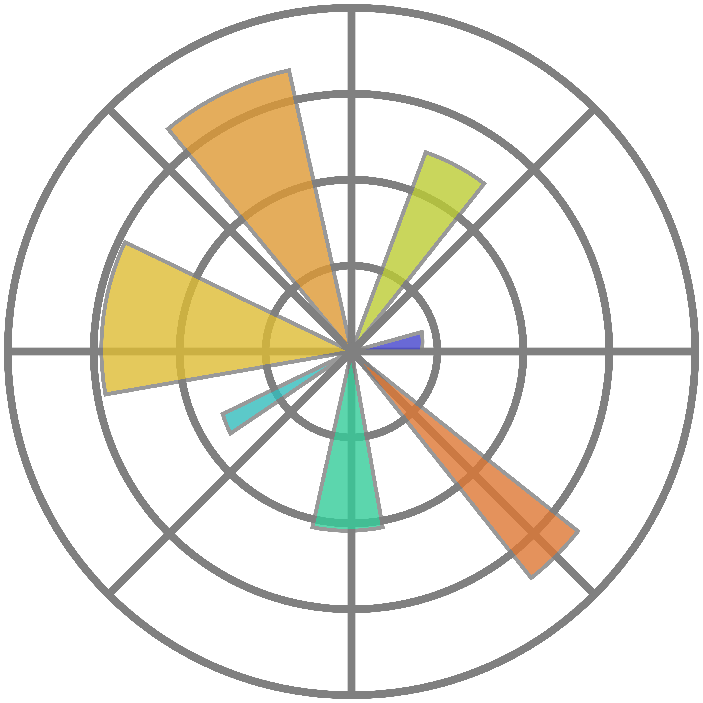
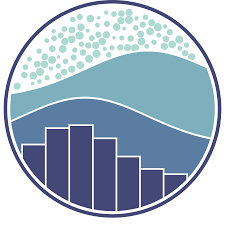
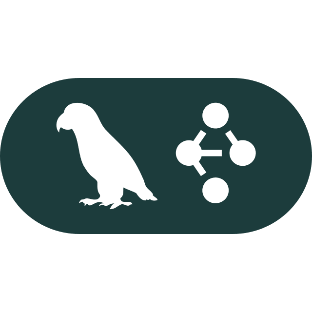
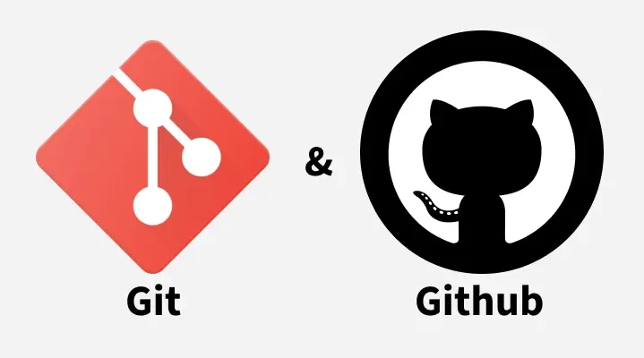
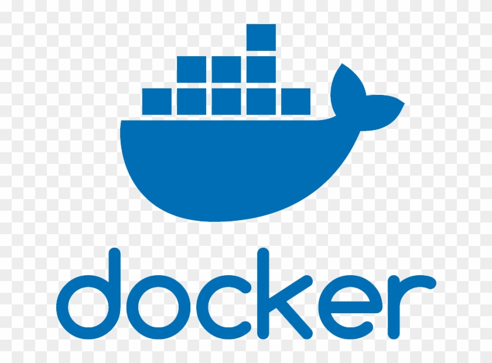
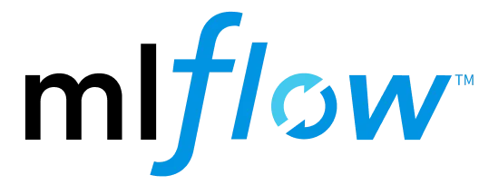
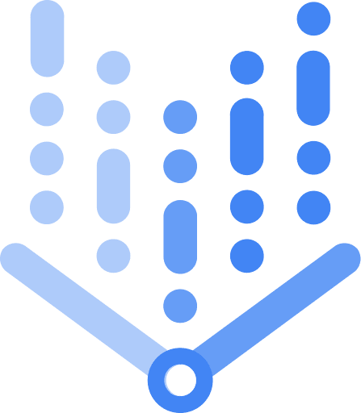
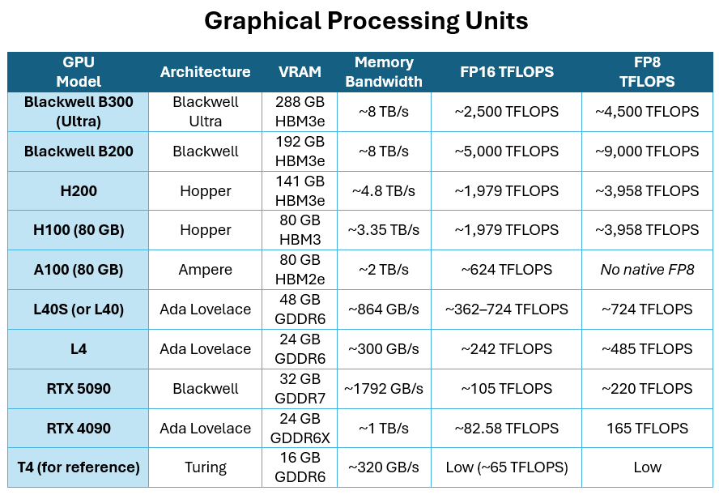

## Cheat Sheet Information
### Read the documentation of the library or the framework for the deep usage

- The Cheat Sheets for <b> Python </b> and <b> its standard libraries </b>:  https://labex.io/pythoncheatsheet/

 <!----------------------------------------------------------------------------------------------------------------------------------------------------------------->

<table>
  <thead>
    <tr>
      <th colspan="3"> Python External Libraries </th>
    </tr>
    <tr>
      <th> Icon </th>
      <th> Library name </th>
      <th> Additional Link </th>
    </tr>
  </thead>
  <tbody>
    <tr> 
        <th>  </th>
        <td> Pandas - Data analysis and manipulations </td>
        <td> https://zerotomastery.io/blog/pandas-101-data-manipulation-with-pandas-and-python/ </td>
    </tr>
    <tr> 
        <th>  </th>
        <td> Matplotlib - Used to create static and interactive data visualizations </td>
        <td> https://zerotomastery.io/blog/matplotlib-guide-python/ </td>
    </tr>
    <tr> 
        <th>  </th>
        <td> Seaborn - It is based on the Matplotlib and used for the statistical graphics </td>
        <td> https://realpython.com/python-seaborn/ </td>
    </tr>
    <tr> 
        <th>  </th>
        <td> Scikit-learn - An open-source library for Machine Learning </td>
        <td> The best is the documentation:   https://scikit-learn.org/0.21/documentation.html </td>
    </tr>
    <tr> 
        <th>  </th>
        <td> Sqlite 3 Lib - A Python library for DB manipulation </td>
        <td> The best is the documentation:   https://docs.python.org/3/library/sqlite3.html </td>
    </tr>
  </tbody>
</table>

 <!----------------------------------------------------------------------------------------------------------------------------------------------------------------->

<table>
  <thead>
    <tr>
      <th colspan="3"> Python Frameworks </th>
    </tr>
    <tr>
      <th> Icon </th>
      <th> Framework name </th>
      <th> Additional Link </th>
    </tr>
  </thead>
  <tbody>
    <tr> 
        <th>  </th>
        <td> FastAPI - Web Framework to build APIs </td>
        <td> https://www.devsheets.io/sheets/fastapi </td>
    </tr>
    <tr>
        <th>  </th>
        <td> PyTorch - An open-source Machine Learning framework </td>
        <td>  https://docs.pytorch.org/tutorials/beginner/basics/intro.html </td>
    </tr>
    <tr>
        <th>  </th>
        <td> LangChain - An open-source development framework designed to build applications powered by LLMs and HuggingFace models </td>
        <td>    
        </td>
    </tr>
    <tr>
        <th>  </th>
        <td> LangGraph - An open-source development framework designed to build applications powered by LLMs and HuggingFace models </td>
        <td> https://sumanmichael.github.io/langgraph-cheatsheet/ </td>
    </tr>
  </tbody>
</table>

 <!----------------------------------------------------------------------------------------------------------------------------------------------------------------->

<table>
  <thead>
    <tr>
      <th colspan="3"> Computer Vision Materials </th>
    </tr>
    <tr>
      <th> Icon </th>
      <th> Library name </th>
      <th> Additional Link </th>
    </tr>
  </thead>
  <tbody>
    <tr> 
        <th>  </th>
        <td> Pillow (PIL) - For simple image manipulations </td>
        <td> https://realpython.com/image-processing-with-the-python-pillow-library/ </td>
    </tr>
    <tr> 
        <th>  </th>
        <td> OpenCV - For the advanced CV algorithms and high-performance processing, often involving video or machine learning integration </td>
        <td> https://www.tutorialspoint.com/opencv/python_opencv_cheatsheet.htm </td>
    </tr>
  </tbody>
</table>

 <!----------------------------------------------------------------------------------------------------------------------------------------------------------------->

<table>
  <thead>
    <tr>
      <th colspan="3"> Other Tools and Platforms </th>
    </tr>
    <tr>
      <th> Icon </th>
      <th> Library name </th>
      <th> Additional Link </th>
    </tr>
  </thead>
  <tbody>
    <tr> 
        <th>  </th>
        <td> HuggingFace - AI platform and community where datasets, model checkpoints are publicly shared </td>
        <td> https://huggingface.co/docs/transformers/en/quicktour </td>
    </tr>
    <tr> 
        <th>  </th>
        <td> Linux - Operating system </td>
        <td> https://cheatography.com/davechild/cheat-sheets/linux-command-line/ </td>
    </tr>
    <tr> 
        <th>  </th>
        <td> Git and Github - Git is a version control system and Github is a platform visualizing Git repositories</td>
        <td>  </td>
    </tr>
    <tr> 
        <th>  </th>
        <td> An open-source platform that packages applications and all their dependencies into lightweight, portable, and isolated containers, ensuring they run consistently on any machine. </td>
        <td>  </td>
    </tr>
    <tr> 
        <th>  </th>
        <td> 
          MLFlow - It is fully free AI lifecycle management platform. There are other better priced and cloud platforms:  (Weights and Biases),  (VertexAI)
        </td>
        <td> The best is the documentation: https://mlflow.org/ </td>
    </tr>
  </tbody>
</table>

 <!----------------------------------------------------------------------------------------------------------------------------------------------------------------->

## GPU Information

